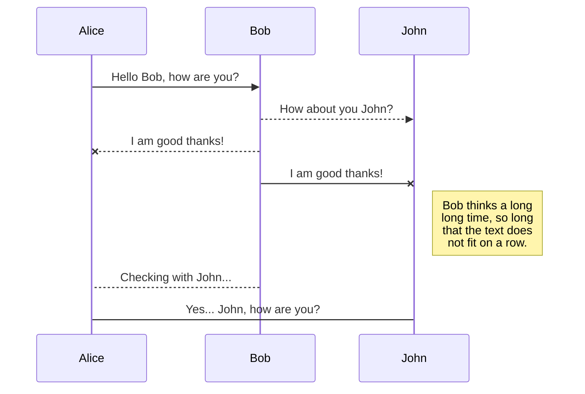
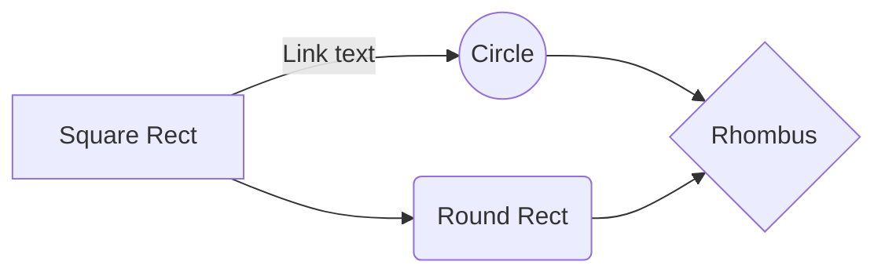

# All about Validation Rules

In this section, we'll be looking over all key aspects of Validation Rules: from how they are defined and used, to how they can be customized to suit one's needs.


They are - quite literally - bread and butter of validation filters. Validation Rules define criteria which any validated object should pass. In essence, a **validation rule** is **some  function** one would call for a **given object**. Going off this reasoning,  we can define the most basic type of rule as being some generic class `ValidationRule<T>`, where `T` can be **any type** of object. This is a nice abstraction, but as we will see later, it isn't even necessary in practice.

### Validation Rule abstraction
```
abstract class ValidationRule
{
    public RuleMetadata Metadata { get; set; }

    public abstract ValidationResult Validate(Object obj, RuleParameters ruleParameters);
}
```

This class describes **the most generic type** of validation rule - the one mentioned just before. 

In practice you'd like a **validation function** to **validate** something, hence the `Validate(...)` method. The method yields a *(drum-rolls)* `ValidationResult`. 

Information of any kind, relating to the rule or not, can be stored in the `Metadata` property. The `RuleMetadata` class can be extended in order to store such information.

### Validation Result

Since any operation yields some result, it's only fitting that validation do so too. The most basic example I can think of would include a success indicator, an error message. Extra points for giving me the validated value and any other useful information it may provide. Something like this:
```
public class ValidationResult
{
    public bool Success { get; set; }
    public string ValidatedValue { get; set; }
    public string Error { get; set; }
    public object MetaData { get; set; }
}
```

### Rule Parameters

These are essentially extra inputs for a given rule. Some rules might require a lower or upper-limit (or both) while others might require a specific value. One rule could require no value, and another might want to cherry-pick a list. Regardless of shape and size, at the end of the day all types of parameters can be boiled down to this:
```
public class RuleParameters
{
}
```

## Rules, Rules, Rules

There's no way around it. It's a rule-based validation filter. We're talking about rules. 

If I were to buy different types of **fruit**, I would apply **some rules**, depending on the type of fruit I want. I like medium-sized red apples, extra-jumbo green watermelons, and teeny-tiny purple grapes. I'm applying rules on the fruits' size and color, but using different criteria depending on the fruit.

Thinking code, such a thing usually calls for more abstraction. Or at the very least, some performance-tuning. We can take advantage of the fact that some rules may repeat, and keep track of any rules we'd like to use. Who knows? - it might save performance.

## Generic Implementation

### ValidationRule&lt;TRules, TObject&gt;

```
internal abstract class ValidationRule<TRules, TObject>
{
    public RuleMetadata<TRules> Metadata { get; set; }
    public abstract ValidationResult Validate(TObject obj, RuleParameters ruleParameters);
}
```
Notice anything different? The abstract class is now generic. Decorated with the two nifty **open types** `TRules` and `TObject`.

The **open type** `TObject` simply defines the **type of object** a filter can validate. Simple as that. You want to validate **some type of object**? You can validate some type of object.

The **open type** `TRules` is a bit more hearty. For instance, it's used to keep track of rules in-memory, and to ensure that every **unique** rule is defined only once. It also plays an important role in (de)serialization and overall performance. Quite the tricky bit.

The generic abstraction `ValidationRule<TRules, TObject>` puts us on the right track. We now have a way of defining a rule for a **given type** of object, and a means to group together rules pertaining to the same category, whichever that may be.

### ValidationRule&lt;TRules, TObject, TProperty&gt;

Like two type constraints weren't enough, here comes the 
## Export a file

You can export the current file by clicking **Export to disk** in the menu. You can choose to export the file as plain Markdown, as HTML using a Handlebars template or as a PDF.


# Synchronization

Synchronization is one of the biggest features of StackEdit. It enables you to synchronize any file in your workspace with other files stored in your **Google Drive**, your **Dropbox** and your **GitHub** accounts. This allows you to keep writing on other devices, collaborate with people you share the file with, integrate easily into your workflow... The synchronization mechanism takes place every minute in the background, downloading, merging, and uploading file modifications.

There are two types of synchronization and they can complement each other:

- The workspace synchronization will sync all your files, folders and settings automatically. This will allow you to fetch your workspace on any other device.
	> To start syncing your workspace, just sign in with Google in the menu.

- The file synchronization will keep one file of the workspace synced with one or multiple files in **Google Drive**, **Dropbox** or **GitHub**.
	> Before starting to sync files, you must link an account in the **Synchronize** sub-menu.

## Open a file

You can open a file from **Google Drive**, **Dropbox** or **GitHub** by opening the **Synchronize** sub-menu and clicking **Open from**. Once opened in the workspace, any modification in the file will be automatically synced.

## Save a file

You can save any file of the workspace to **Google Drive**, **Dropbox** or **GitHub** by opening the **Synchronize** sub-menu and clicking **Save on**. Even if a file in the workspace is already synced, you can save it to another location. StackEdit can sync one file with multiple locations and accounts.

## Synchronize a file

Once your file is linked to a synchronized location, StackEdit will periodically synchronize it by downloading/uploading any modification. A merge will be performed if necessary and conflicts will be resolved.

If you just have modified your file and you want to force syncing, click the **Synchronize now** button in the navigation bar.

> **Note:** The **Synchronize now** button is disabled if you have no file to synchronize.

## Manage file synchronization

Since one file can be synced with multiple locations, you can list and manage synchronized locations by clicking **File synchronization** in the **Synchronize** sub-menu. This allows you to list and remove synchronized locations that are linked to your file.


# Publication

Publishing in StackEdit makes it simple for you to publish online your files. Once you're happy with a file, you can publish it to different hosting platforms like **Blogger**, **Dropbox**, **Gist**, **GitHub**, **Google Drive**, **WordPress** and **Zendesk**. With [Handlebars templates](http://handlebarsjs.com/), you have full control over what you export.

> Before starting to publish, you must link an account in the **Publish** sub-menu.

## Publish a File

You can publish your file by opening the **Publish** sub-menu and by clicking **Publish to**. For some locations, you can choose between the following formats:

- Markdown: publish the Markdown text on a website that can interpret it (**GitHub** for instance),
- HTML: publish the file converted to HTML via a Handlebars template (on a blog for example).

## Update a publication

After publishing, StackEdit keeps your file linked to that publication which makes it easy for you to re-publish it. Once you have modified your file and you want to update your publication, click on the **Publish now** button in the navigation bar.

> **Note:** The **Publish now** button is disabled if your file has not been published yet.

## Manage file publication

Since one file can be published to multiple locations, you can list and manage publish locations by clicking **File publication** in the **Publish** sub-menu. This allows you to list and remove publication locations that are linked to your file.


# Markdown extensions

StackEdit extends the standard Markdown syntax by adding extra **Markdown extensions**, providing you with some nice features.

> **ProTip:** You can disable any **Markdown extension** in the **File properties** dialog.


## SmartyPants

SmartyPants converts ASCII punctuation characters into "smart" typographic punctuation HTML entities. For example:

|                |ASCII                          |HTML                         |
|----------------|-------------------------------|-----------------------------|
|Single backticks|`'Isn't this fun?'`            |'Isn't this fun?'            |
|Quotes          |`"Isn't this fun?"`            |"Isn't this fun?"            |
|Dashes          |`-- is en-dash, --- is em-dash`|-- is en-dash, --- is em-dash|


## KaTeX

You can render LaTeX mathematical expressions using [KaTeX](https://khan.github.io/KaTeX/):

The *Gamma function* satisfying $\Gamma(n) = (n-1)!\quad\forall n\in\mathbb N$ is via the Euler integral

$$
\Gamma(z) = \int_0^\infty t^{z-1}e^{-t}dt\,.
$$

> You can find more information about **LaTeX** mathematical expressions [here](http://meta.math.stackexchange.com/questions/5020/mathjax-basic-tutorial-and-quick-reference).


## UML diagrams

You can render UML diagrams using [Mermaid](https://mermaidjs.github.io/). For example, this will produce a sequence diagram:



And this will produce a flow chart:

